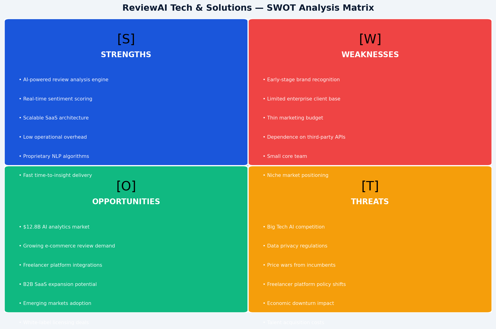
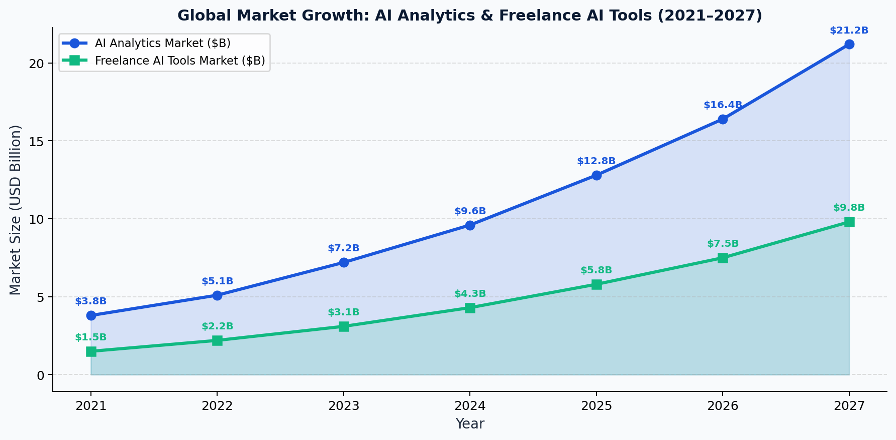
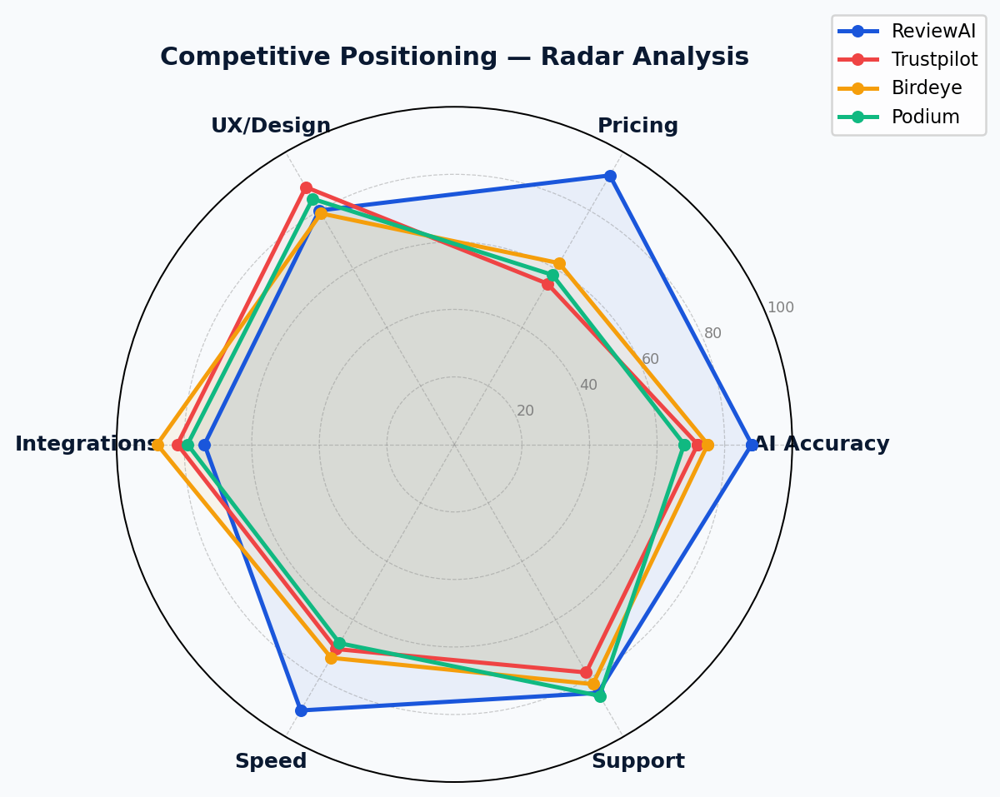
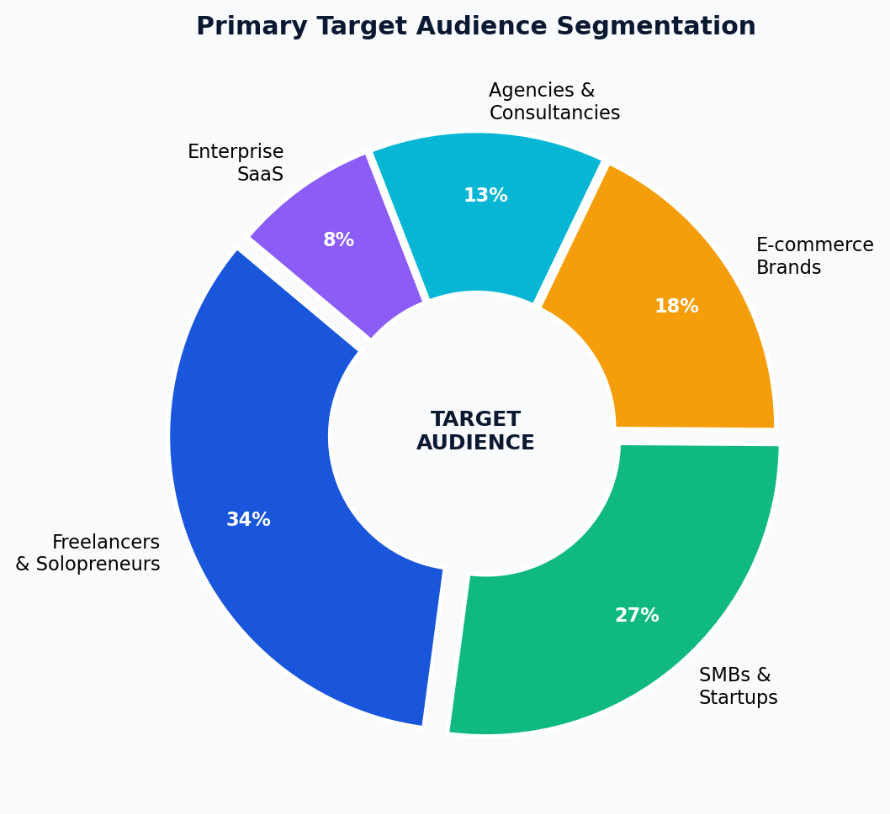
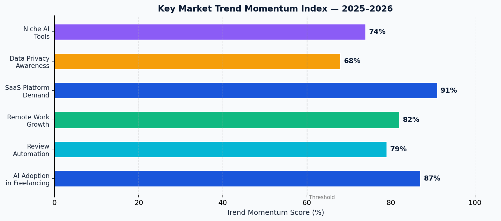

<div align="center">

# 📊 ReviewAI Tech & Solutions
### Market Research Report — Business & Marketing Strategy

[](https://www.codealpha.tech)
[](https://www.codealpha.tech)
[](https://www.codealpha.tech)
[](./report/ReviewAI_Market_Research_Report.pdf)
[](https://yourusername.github.io/reviewai-market-research)

<br/>

> *"Data is the new oil — but insight is the refinery."*
> 
> A comprehensive, data-driven market research analysis of **ReviewAI Tech & Solutions**, an AI-powered review intelligence startup operating at the intersection of the global freelancing economy and artificial intelligence analytics.

---

**[📥 Download Full PDF Report](./report/ReviewAI_Market_Research_Report.pdf)** &nbsp;|&nbsp; **[🌐 View Portfolio](./portfolio/index.html)** &nbsp;|&nbsp; **[📈 View Charts](./assets/charts/)**

</div>

---

## 🗂️ Table of Contents

- [Project Overview](#-project-overview)
- [Key Findings](#-key-findings-at-a-glance)
- [Report Structure](#-report-structure)
- [Visual Highlights](#-visual-highlights)
- [Repository Structure](#-repository-structure)
- [Methodology](#-methodology)
- [Tech Stack](#-tech-stack)
- [How to Regenerate](#-how-to-regenerate-the-report)
- [About the Author](#-about-the-author)
- [Internship Details](#-internship-details)

---

## 🚀 Project Overview

This project delivers a **4-page professional market research report** for **ReviewAI Tech & Solutions**, a startup leveraging AI-powered NLP to automate and analyze customer reviews for freelancers, SMBs, and e-commerce brands.

The report covers:

| Section | Description |
|--------|-------------|
| **SWOT Analysis** | Full quadrant matrix with strategic narrative |
| **Target Audience** | 5-segment audience with WTP, priority scoring |
| **Competitive Landscape** | Radar benchmarking vs. Trustpilot, Birdeye, Podium |
| **Market Trends** | 2021–2027 growth projections + trend momentum index |
| **Strategic Recommendations** | 4 actionable, data-backed growth strategies |

---

## 📌 Key Findings at a Glance

```
┌─────────────────────────────────────────────────────────────────┐
│                    MARKET SNAPSHOT 2025                         │
├───────────────────┬──────────────────┬──────────────────────────┤
│  Market Size      │  CAGR (2024-27)  │  Global Freelancers      │
│    $12.8B         │    27.4%         │    1.57 Billion          │
├───────────────────┼──────────────────┼──────────────────────────┤
│  AI Tool Adoption │  Top Segment WTP │  ReviewAI Accuracy       │
│    68%            │  $9 – $1,000+/mo │    88%+                  │
└───────────────────┴──────────────────┴──────────────────────────┘
```

### Top SWOT Highlights

- ✅ **Strength** — Proprietary NLP engine with 88%+ sentiment accuracy; real-time sub-2-second insights
- ⚠️ **Weakness** — Early-stage brand recognition; third-party API cost exposure
- 🚀 **Opportunity** — $21.2B AI analytics market by 2027; white-label licensing for freelancer platforms
- 🛡️ **Threat** — Big Tech AI competition; GDPR/DPDP compliance overhead

---

## 📋 Report Structure

```
Page 1 ─── Cover + Executive Summary + KPI Banner + Project Metadata
Page 2 ─── SWOT Analysis Matrix (Chart) + Detailed Narrative Table
Page 3 ─── Target Audience Segmentation (Chart) + Audience Table
           Competitive Landscape Radar (Chart) + Competitor Matrix
Page 4 ─── Market Growth Projections (Chart) + Trend Momentum (Chart)
           Strategic Recommendations (4 Action Items)
```

---

## 📊 Visual Highlights

<table>
  <tr>
    <td align="center">
      <br/>
      <sub><b>SWOT Analysis Matrix</b></sub>
    </td>
    <td align="center">
      <br/>
      <sub><b>Market Growth 2021–2027</b></sub>
    </td>
  </tr>
  <tr>
    <td align="center">
      <br/>
      <sub><b>Competitive Positioning Radar</b></sub>
    </td>
    <td align="center">
      <br/>
      <sub><b>Audience Segmentation Donut</b></sub>
    </td>
  </tr>
  <tr>
    <td colspan="2" align="center">
      <br/>
      <sub><b>Market Trend Momentum Index 2025–2026</b></sub>
    </td>
  </tr>
</table>

---

## 📁 Repository Structure

```
reviewai-market-research/
│
├── 📄 README.md                    ← You are here
├── 📄 LICENSE                      ← MIT License
├── 📄 .gitignore
│
├── 📂 report/
│   └── ReviewAI_Market_Research_Report.pdf   ← Final deliverable (4 pages)
│
├── 📂 assets/
│   └── charts/
│       ├── swot.png                ← SWOT quadrant matrix
│       ├── market_growth.png       ← Market growth line chart
│       ├── radar.png               ← Competitive positioning radar
│       ├── audience.png            ← Audience segmentation donut
│       └── trends.png              ← Trend momentum bar chart
│
├── 📂 portfolio/
│   └── index.html                  ← GitHub Pages portfolio site
│
├── 📂 src/
│   └── generate_report.py          ← Python script to regenerate PDF
│
└── 📂 docs/
    └── methodology.md              ← Research methodology notes
```

---

## 🔬 Methodology

| Step | Activity | Tools / Sources |
|------|----------|-----------------|
| 1 | Industry scoping & company profiling | Primary research |
| 2 | SWOT framework development | Business analysis frameworks |
| 3 | Audience segmentation modeling | Persona-based segmentation |
| 4 | Competitive intelligence | Feature benchmarking |
| 5 | Market sizing & trend analysis | Statista, Grand View Research, McKinsey GI |
| 6 | Data visualization | Python · Matplotlib |
| 7 | Professional PDF generation | Python · ReportLab |

---

## 🛠️ Tech Stack


---

## ⚡ How to Regenerate the Report

```bash
# 1. Clone the repository
git clone https://github.com/yourusername/reviewai-market-research.git
cd reviewai-market-research

# 2. Install dependencies
pip install reportlab matplotlib numpy

# 3. Run the generator
python src/generate_report.py

# Output → report/ReviewAI_Market_Research_Report.pdf
```

**Requirements:** Python 3.10+, pip

---

## 👤 About the Author

**[Your Name]**  
Business & Marketing Strategy Intern @ CodeAlpha

[](https://linkedin.com/in/yourprofile)
[](https://github.com/yourusername)
[](mailto:your@email.com)

---

## 🎓 Internship Details

| Field | Detail |
|-------|--------|
| **Program** | Business & Marketing Strategy Internship |
| **Organization** | [CodeAlpha](https://www.codealpha.tech) |
| **Task** | Task 1 — Market Research Report |
| **Company Analyzed** | ReviewAI Tech & Solutions |
| **Industry** | Freelancing / AI-Powered SaaS Startup |
| **Deliverable** | 3–4 page report with charts/graphs |
| **Status** | ✅ Completed |

---

<div align="center">

**If this helped you, please ⭐ star this repo!**

Made with 💙 as part of the CodeAlpha Internship Program

[](https://www.codealpha.tech)

</div>
